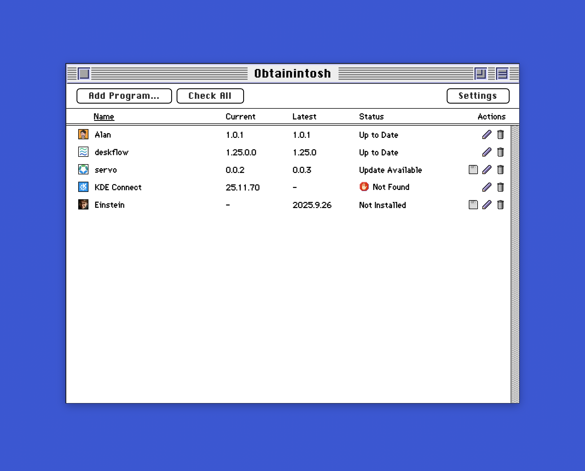

# Obtainintosh

Obtainintosh is a Tauri-based Mac OS X program that helps you manage and update apps distributed through GitHub releases, similar to Obtainium for Android. It's also the most Mac-like program ever released on Mac OS X.



## Installation

```bash
# Clone the repository
cd obtainintosh

# Install dependencies
npm install

# Run in development mode
npm run tauri dev

# Build for production
npm run tauri build
```

The built program will be in `src-tauri/target/release/bundle/dmg/`